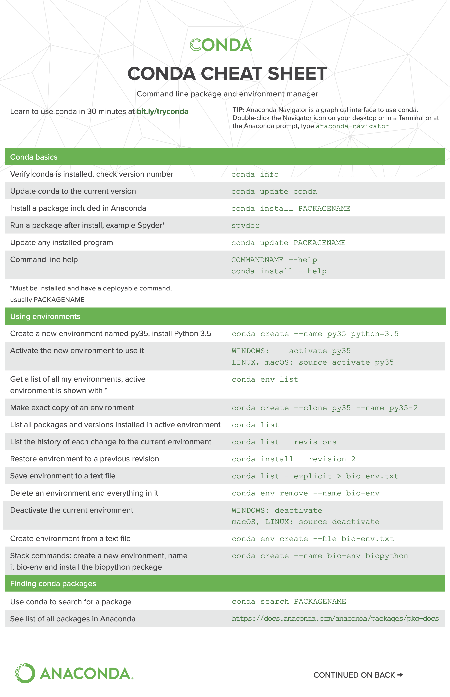

# Cheatsheets

## Conda



## Docker


## Linux


## General tips

- When installing [```psbody.mesh```](https://github.com/MPI-IS/mesh), install ```opengl``` in the linux container using the following command

    ```{note}
    Perform this step after using the ```make all``` command
    ```

    ```
    apt-get update && install python3-opengl

    conda install -c anaconda pyopengl
    ```

- FLAME, MICA, DECA and FLAME fitting libraries use the same FLAME 2020 model. Don't download them seperately (unless the library is being run individually) instead, use the same model. Create an account at ```https://flame.is.tue.mpg.de/index.html``` to download all FLAME model related content. 

- In the MICA container, use the ```emteq_dc``` conda environment for code execution.

- Always install ```opencv-python==4.6.0.68``` in all mesh libraries. Older versions of ```opencv``` incorrectly orient ```.mov``` and ```.MOV``` files. 

- While installing the [flame-fitting](https://github.com/Rubikplayer/flame-fitting) library, don't clone the ```eigen``` library from github. Instead, download the 3.3 version from [here](https://eigen.tuxfamily.org/index.php?title=Main_Page).

- To use ```jupyter-lab``` or ```jupyter-notebook``` on a remote server (without VSCode or any code editor), use the following command:
    ```{note}
    The below command uses port forwarding to access ```ipython-notebooks``` on your local machine. Copy the URL (example: http://127.0.0.1:10000/lab?token=9b293f9673723248414a20f89ef0a936159b1d5714ba2832) in the browser.
    ```

    ```
    jupyter lab --ip 0.0.0.0 --port 10000 --allow-root
    ```

- Avoid opening mesh analysis or shapecode analysis notebook files in VSCode or any code editor (they will crash). Use ```jupyter-lab``` or ```jupyter-notebook``` instead. 

- When executing ```mesh.py``` or ```participants.py``` change the directory to the following:
    ```
    cd MICA/src/dc_analysis/notebooks
    ```

(issues)=
## Issues:
1. In the FLAME reverse fitting algorithm (used throughout this project in all code repos), the H2_FLAME models are not in the correct co-ordinate space as the fitting procedure converts the arbitrary mesh to FLAME co-ordinate space (by approximating a scaling factor). The scaled mesh is then used for conversion into FLAME. At the end of the code, the initially calculated scale needs to be re-applied to the output mesh to fix this problem but it would require the entire loading process to be repeated for each participant. Alternative, another script can be written which only calculates the scaling factors of all meshes and applies them to the previously created meshes.